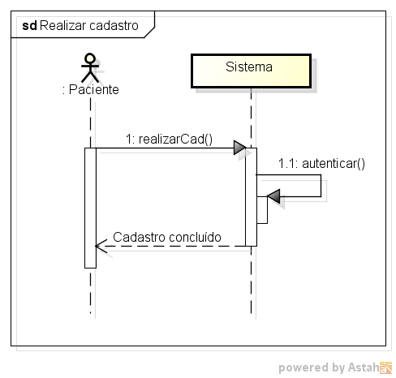
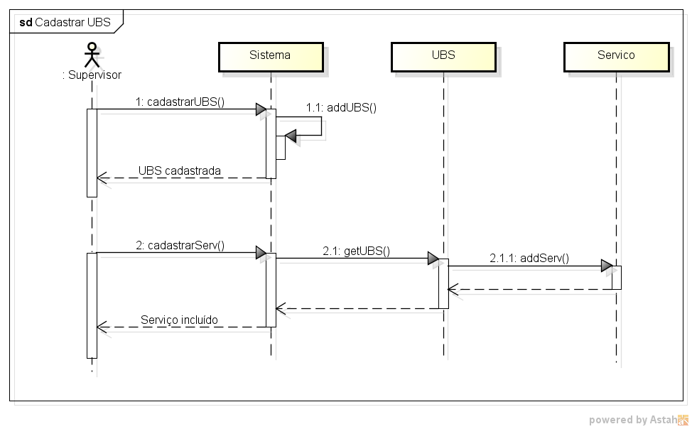
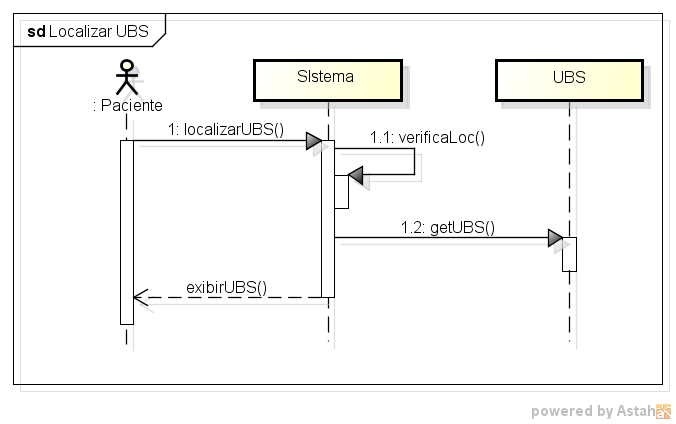
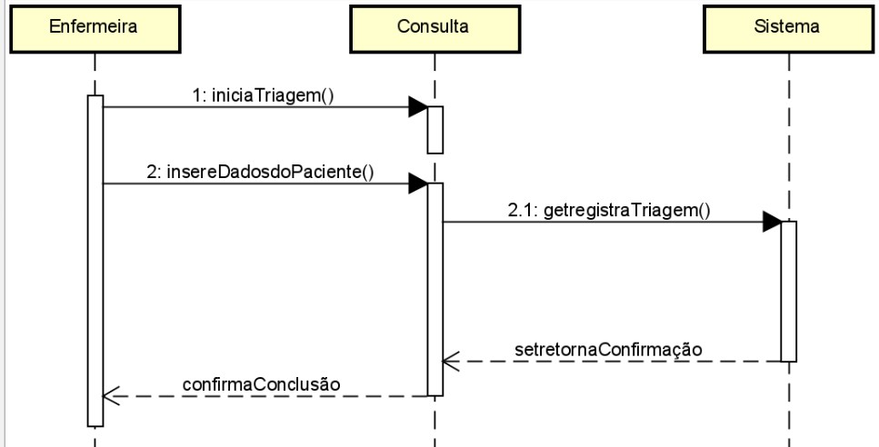

## DIAGRAMAS DE SEQUÊNCIA

Autores: João Carlos e Nicolas Rocha

### 1. Realizar cadastro do paciente

### 2. Realizar cadastro dos funcionários da UBS

### 3. Acessar serviços

### 4. Marcar consulta

### 5. Cadastrar UBS e seus serviços

### 6. Localizar UBS

### 7. Visualizar consulta

### 8. Realizar atendimento

### 9. Realizar triagem

### 10. Realizar consulta

### 11. Consultar endereço

### 12. Realizar orientaçõa

