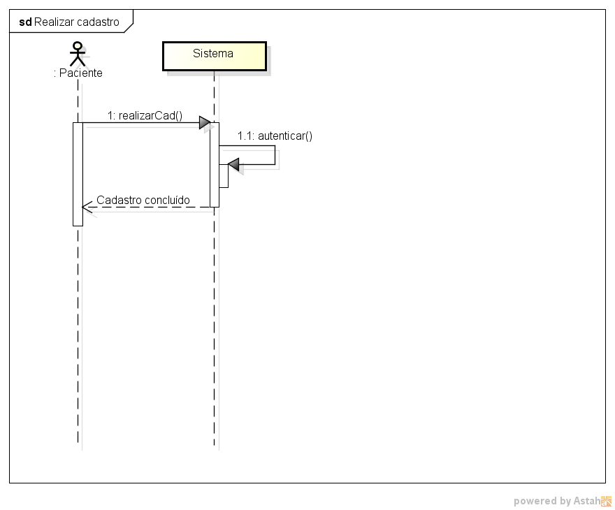
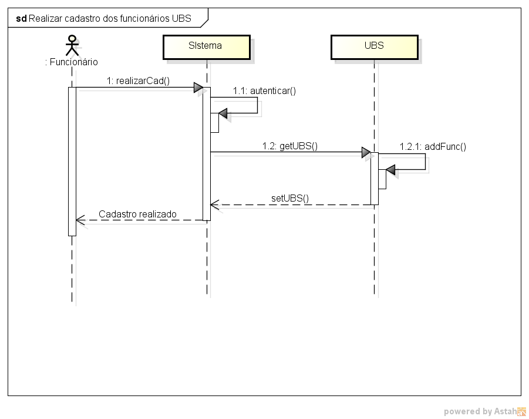
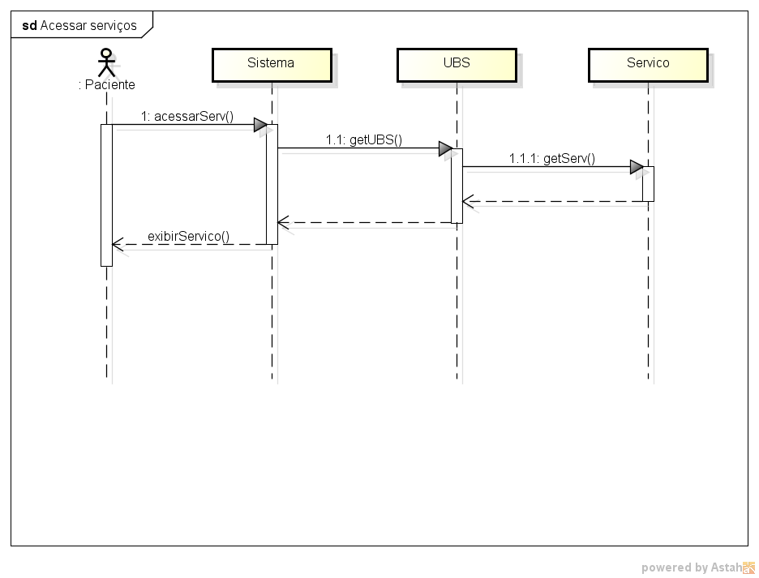
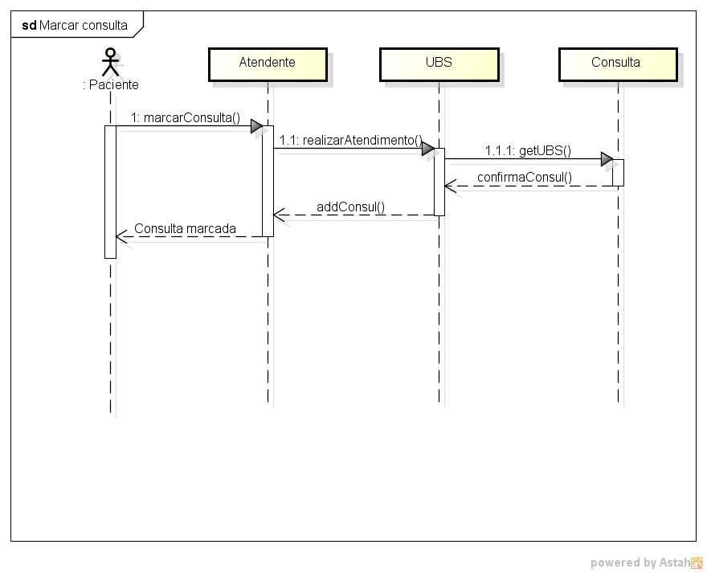
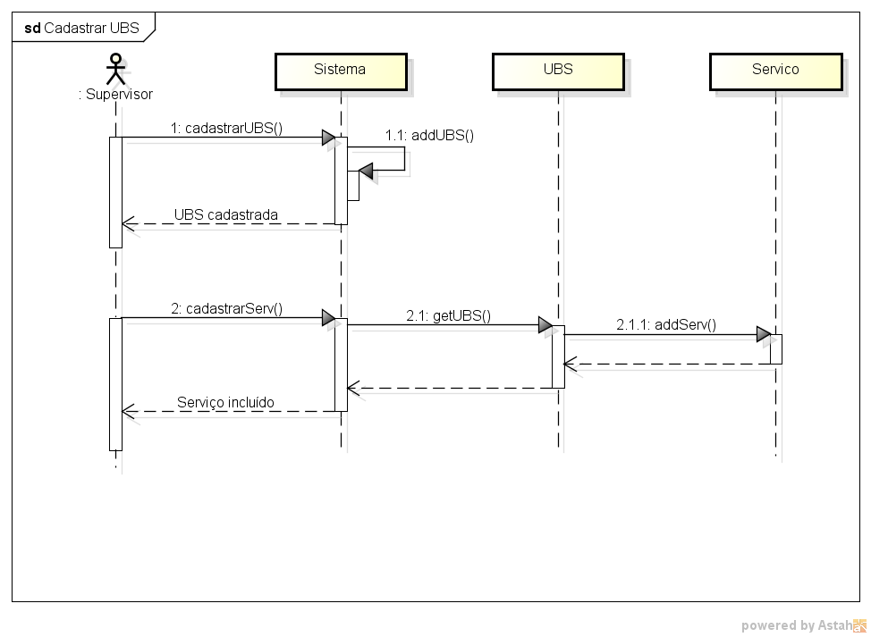

## DIAGRAMAS DE SEQUÊNCIA

Autores: João Carlos e Nicolas Rocha

### 1. Realizar cadastro do paciente

### 2. Realizar cadastro dos funcionários da UBS

### 3. Acessar serviços

### 4. Marcar consulta

### 5. Cadastrar UBS e seus serviços

### 6. Localizar UBS

