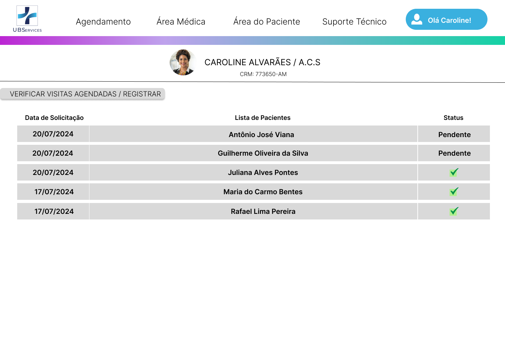
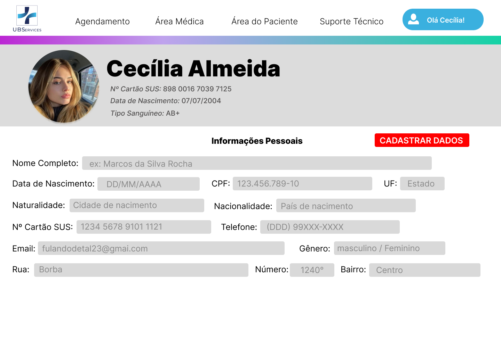

# User story 5 infringiu a heurística 3 de Nielsen:

Há o defeito de que o sistema deveria possuir um comando para retornar para a tela anterior.

Na alteração realizada após a inspeção, se adicionou um signo dinâmico para o retorno da aba anterior.

---

# User story 10 infringiu a heurística 4 de Nielsen:

O defeito encontrado foi que a tela não seguiu o padrão de cores das telas anteriores.

Como alteração da tela, foram modificadas as cores para se assemelhar as telas anteriores.

---

# User story 12 infringiu a heurística 5 de Nielsen:

O defeito percebido foi que não há restrições para os dados a serem adicionados, de forma que os usuários podem adicionar letras onde deveriam ser números.

Para a correção do defeito, foram adicionadas especificações nos signos onde se adicionam as informações.

---

# User story 12.2 infringiu a heurística 3 de Nielsen:

O defeito reconhecido é que não há um signo para iniciar o comando de edição das informações.

Para a correção, se adicionou os signos dinâmicos para a alteração de perfil e de dados pessoais.

---

# User story 15 infringiu a heurística 3 de Nielsen:

O defeito encontrado foi que não há um comando para a edição do bairro da UBS.

Para a correção do erro se adicionou um signo dinâmico para a edição do bairro.

