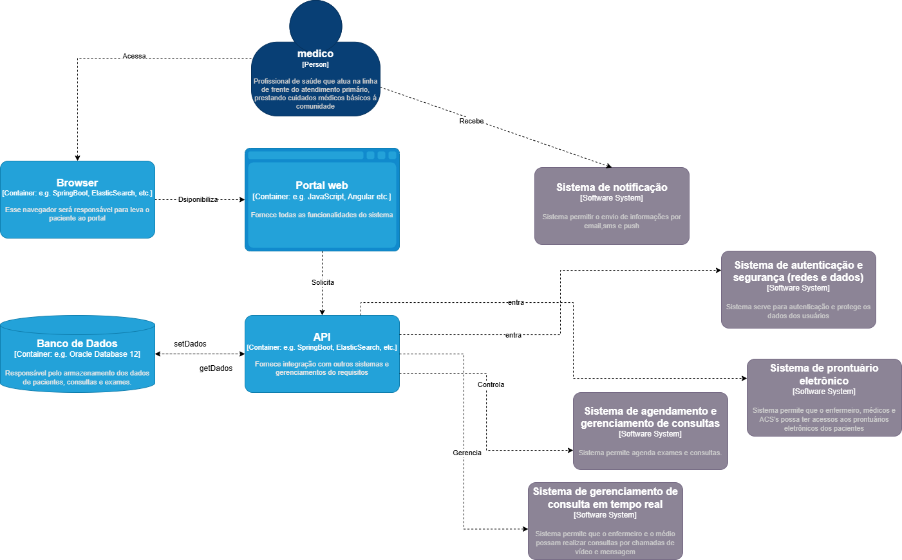
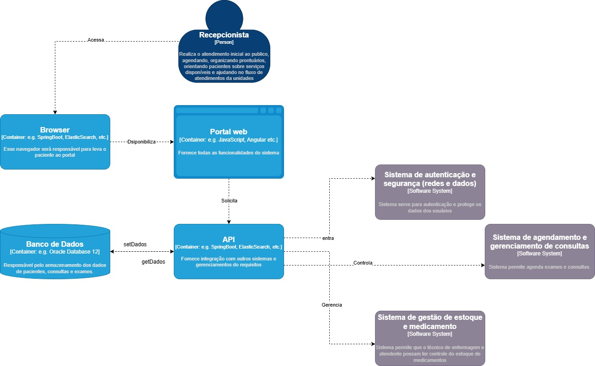

## NÍVEL 2 - CONTAINER

O nível de conteiner expõe a arquitetura de forma simplificada, exibindo as tecnologias usadas e como a comunicação acontece.

O diagrama de container contém um nível maior de detalhes e é útil para a(s) equipe(s) de desenvolvimento, arquitetos e devOps.

## DIAGRAMAS

Autor: Luiz Mendes

### 1. Paciente

### 2. Médico

### 3. Enfermeira

### 4. Recepcionista

### 5. Supervisor

### 6. Técnico de Enfermagem

