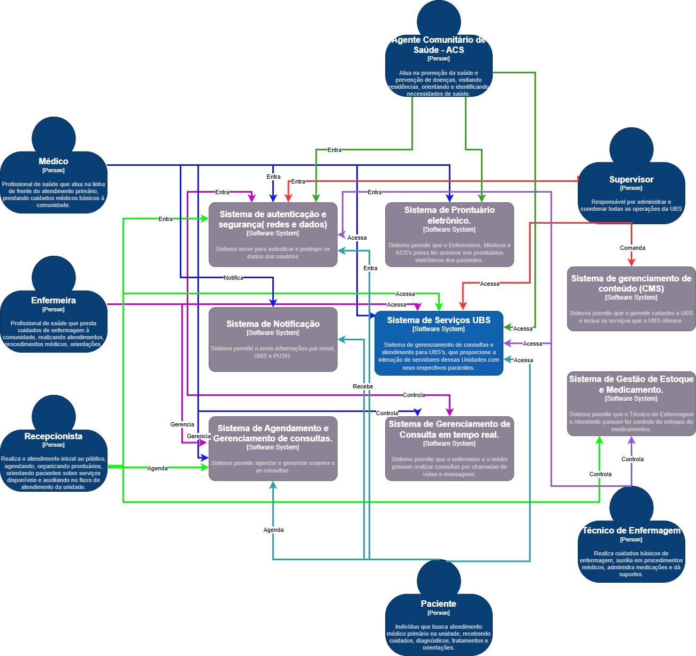

## NÍVEL 1 - CONTEXTO

O nível de contexto fornece uma visão geral do sistema, mostrando como ele se encaixa no ambiente mais amplo. 

É identificado os principais atores externos (usuários, sistemas externos) e como eles interagem com o sistema.

## SISTEMAS EXTERNOS

1. **Sistema de Autenticação e Segurança**: Sistema voltado para autenticar e proteger os dados dos usuários utilizando criptografia de dados e restrições de endreços IPs. Todos os atores utilizam este sistema.
   
2. **Sistema de Prontuário Eletrônico**: Sistema que permite que Enfermeiros, Médicos e ACS's possam ter acesso aos prontuários eletrônicos dos pacientes, assim como preencher com novos dados e etc.

3. **Sistema de Notificação**: Sistema para envio de informações por email, SMS e PUSH,  onde o paciente e médico conseguem ser informados pelo agendamento de consultas.

4. **Sistema de Agendamento e Gerenciamento de Consultas**: Sistema onde permite que atendente e o médico possa agendar e gerenciar exames e consultas.

5. **Sistema de Gerenciamento de Consulta em Tempo Real**: Sistema que permite que enfermeiros e médicos possam visualizar e acompanhar as chamadas de consultas e mensagens.

6. **Sistema de Gestão de Estoque e Medicamentos**: Sistema onde permite que o supervisor e o técnico de enfermagem controlem a entrada e saída do estoque de medicamentos e materiais.

7. **Sistema de Gerenciamento de Conteúdo**: Sistema que permite que o gerente cadastre a UBS e inclua os seus serviços. 

## DIAGRAMA

Autores: Hélio Nogueira e Chyntia Freitas

